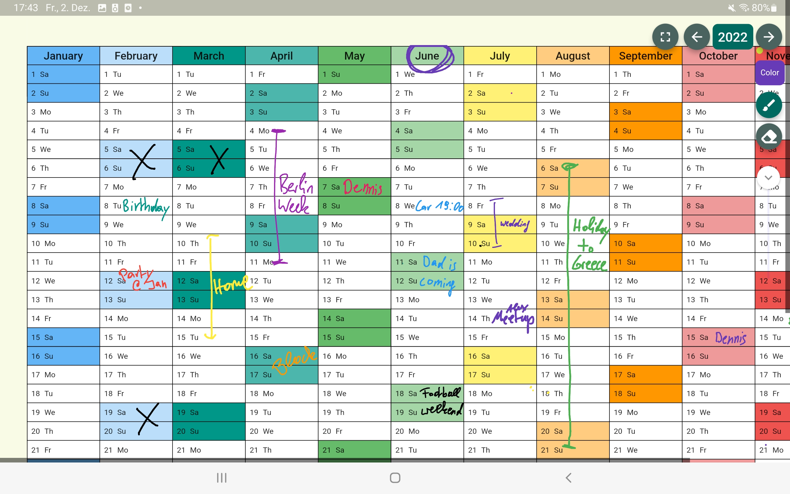

# Stift Flutter App: The Calendar for Tablets  

Welcome to Stift. Use your tablet pen the way it should be used: Draw your appointments instead of typing them.

## Flutter App

This App is completely built with Dart / Flutter.

### Preview

### Stylus or finger drawing

This app detects whether you are using a stylus or your finger to draw on the calendar.

## Tech Specs
* State Management: Riverpod
* Database: Firebase, Firestore

### Some Tech Insights

* The app uses the Listener-Widget to recognize the use of a pen instead of a finger with Flutter. 
* I ended up using the InteractiveViewer widget to pinch-zoom with two fingers which works pretty well but it still limits the desired behaviour. 
  * Example: If you turn off drawing with your fingers and draw only with the pen, you should be able to scroll through the calendar with one finger. This does not work with the InteractiveViewer since the Listener catches the one-finger touch event instead of the InteractiveViewer

### The Limits of Riverpod
Whenever you draw on the calendar, the Listener-Widget detects the exact position to draw a colorful point. This Listener-Event triggers a few hundred times per second and i saved the exact position inside a Riverpod StateNotifier. Another widget is listening on that state and paints the colorful point. first: it worked but the update mechanism was just too slow. The drawing was painted on the screen too late and it looked super laggy.

I solved this issue with a classic Flutter StatefulWidget and the `setState(...)` method. Please try it out, it works pretty well.

## Run Locally

* Since this app relies on firebase, you need to create a firebase project and replace the google-services.json.
  ** Also enable the Firestore Database.
* You also need to create a keystore file and insert the key.properties file or remove the signing configs inside the build.gradle
  ** it's probably easier to just disable the signing in `/android/app/build.gradle`

### Google services files:

* `/lib/firebase_options.dart`
* `/ios/GoogleService-Info.plist`
* `/android/app/google-services.json`
  

# Download from the App Stores

* [Download on Google Play Store](https://play.google.com/store/apps/details?id=app.tnx.tabletcalendar)
* [Download on Apple App Store](https://apps.apple.com/us/app/stift-calendar-for-tablet-pen/id1661094074)
